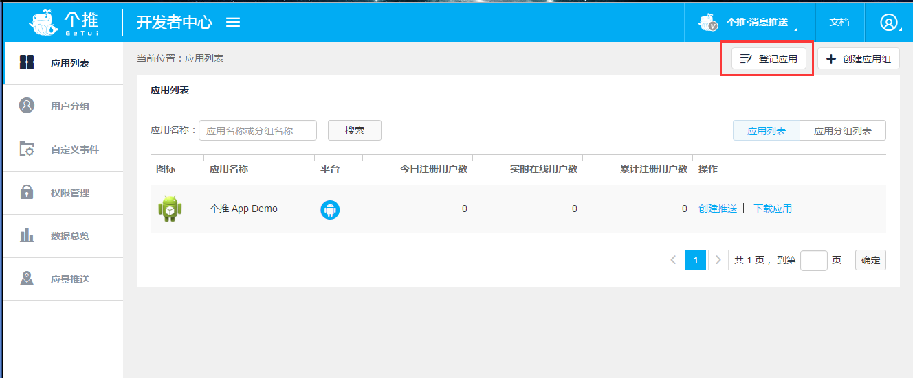
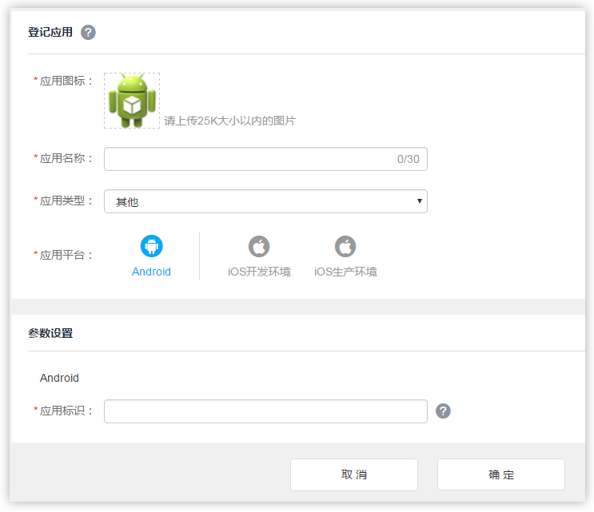
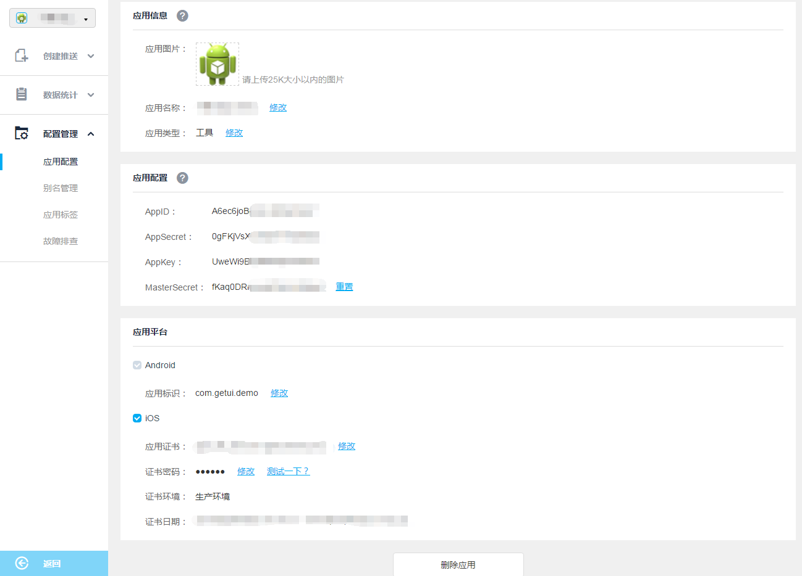

##1. 创建个推应用  
请登录 `http://dev.getui.com`，选择`登记应用`并填写应用名称和包名信息，完成应用创建：
  
  
点击`应用配置`，获取到相应的`AppID`、`AppKey`、`AppSecret`信息：
  
##2.添加个推SDK及相关配置
将[getui-htzq-20180717.jar](mdImg/getui_htzq_20180717.jar)复制到`app`模块（application moudle）下`libs`文件夹中   

 

打开`app/build.gradle`，在dependencies中添加相应的jar包的引用：  
```Java
    compile fileTree(dir: 'libs', include: ['*.jar'])
```
##3.添加权限声明
请在`<manifest>`根标签下加入个推SDK所必需的权限，配置如下
```Java
    <uses-permission android:name="android.permission.WRITE_EXTERNAL_STORAGE" />
```
##4.配置自定义推送服务

在项目源码中添加一个继承自Android.app.Service的类，参考下列代码实现Service各个生命周期回调方法：  
```Java
package com.getui.demo;

import android.app.Service;
import android.content.Intent;
import android.os.IBinder;

import com.igexin.sdk.GTServiceManager;

public class DemoPushService extends Service {

    @Override
    public void onCreate() {
        super.onCreate();
        GTServiceManager.getInstance().onCreate(this);
    }

    @Override
    public int onStartCommand(Intent intent, int flags, int startId) {
        super.onStartCommand(intent, flags, startId);
        return GTServiceManager.getInstance().onStartCommand(this, intent, flags, startId);
    }

    @Override
    public IBinder onBind(Intent intent) {
        return GTServiceManager.getInstance().onBind(intent);
    }

    @Override
    public void onDestroy() {
        super.onDestroy();
        GTServiceManager.getInstance().onDestroy();
    }

    @Override
    public void onLowMemory() {
        super.onLowMemory();
        GTServiceManager.getInstance().onLowMemory();
    }
}

```
  
在项目源码中添加一个继承自com.igexin.sdk.GActivity的类，参考下列代码：  
```Java
package com.getui.demo;
import com.igexin.sdk.GActivity;

public class DemoActivity extends GActivity {

}
```
在`AndroidManifest.xml`中添加上述自定义Service和Activity：
```Java
<service
  android:name="com.getui.demo.DemoPushService"
  android:exported="true"
  android:label="PushService"
  android:process=":pushservice">
</service>
<activity 
	android:name="com.getui.demo.DemoActivity"
	android:exported="true"
	android:process=":pushservice"
	android:theme="@android:style/Theme.Translucent.NoTitleBar" 
   />

```
##5.Proguard混淆配置
```Java
-dontwarn com.igexin.**
-keep class com.igexin.** { *; }
```

##6.编写集成代码
初始化SDK，在 Activity 的onCreate()或者onResume()方法中调用个推SDK初始化方法  
```Java
PushManager.getInstance().registerPushActivity(this, DemoActivity.class);
                PushManager.getInstance().initialize(this, XxPushService.class, "your_appid", "your_appkey", "your_appsecret");
```
  
将`your_*`替换成步骤一中获取到的`AppID`、`AppKey`、`AppSecret`

